# 📊 InsightHub

InsightHub, şirket çalışanlarının günlük veri girişlerini ve geri bildirimlerini kolayca yönetebildiği, yöneticilerin ise bu verileri filtreleyerek analiz edebildiği kurumsal bir iç iletişim ve takip platformudur. Proje Java Spring Boot (Backend) ve React + Material UI (Frontend) kullanılarak geliştirilmiştir.

---

## 🚀 Özellikler

- Kullanıcı girişi ve kayıt sistemi  
- Günlük veri giriş ekranı  
- Geri bildirim gönderme ve listeleme  
- Tarihe göre geri bildirim filtreleme  
- Kullanıcı profil ekranı  
- Yalnızca adminlerin tüm verileri görebildiği yönetim paneli  
- Swagger UI ile API test imkanı  
- Tarih aralığına göre veri filtreleme  
- Belirli kullanıcıya göre veri listeleme  
- Otomatik rol kontrolü ile admin/kullanıcı veri erişimi ayrımı  
- Şifre güncelleme özelliği  
- React Router ile dinamik sayfa yönlendirmeleri  
- Material UI ile modern kullanıcı arayüzü  
- API'ler Axios ile güvenli biçimde entegre edildi  

---

## 🧰 Kullanılan Teknolojiler

### Backend:
- Java 17
- Spring Boot
- Spring Data JPA
- PostgreSQL
- Swagger

### Frontend:
- React (Vite ile kuruldu)
- Material UI
- Axios
- React Router DOM

---

## 🖼️ Ekran Görüntüleri

### 🔐 Giriş Ekranı
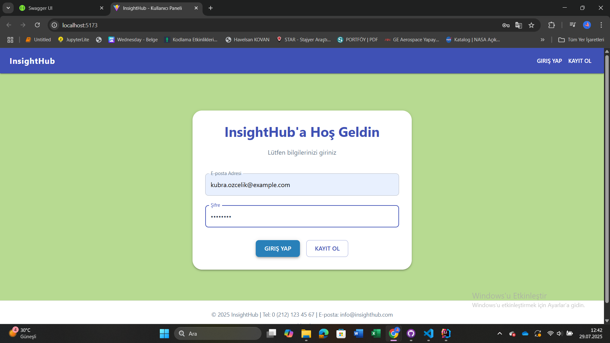

### 📝 Kayıt Sayfası
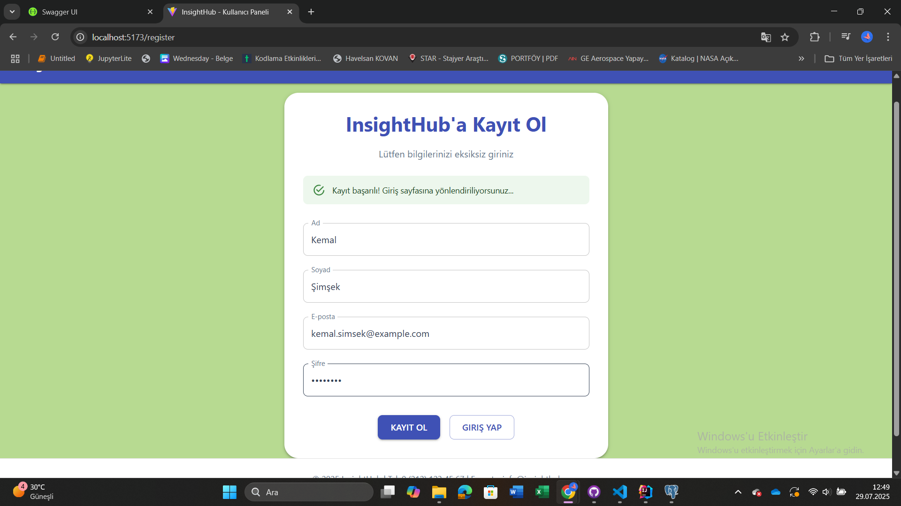

### 📥 Veri Girişi
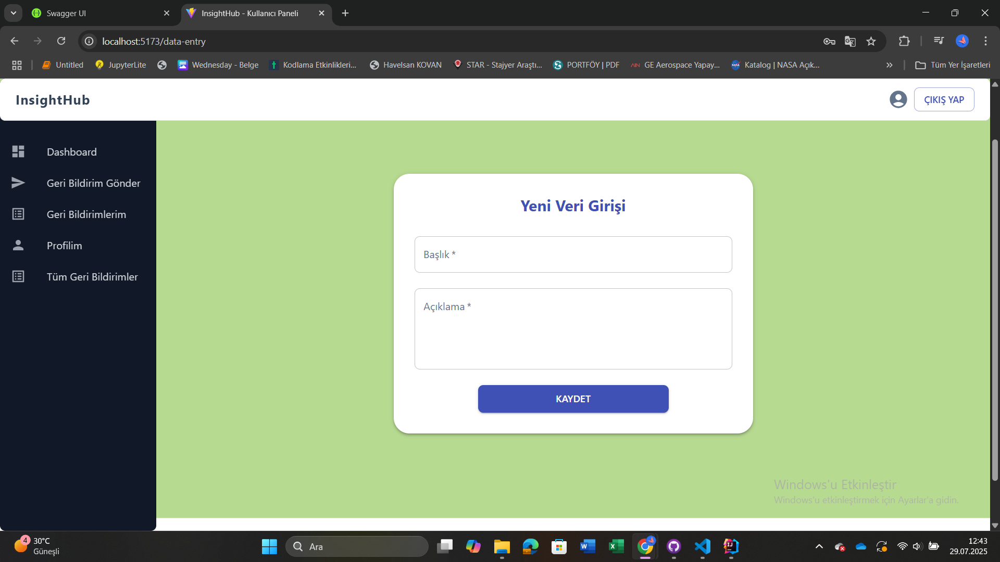

### 📤 Geri Bildirim Gönderme
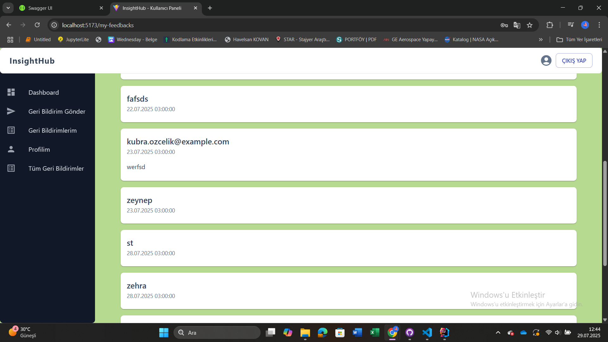

### Çalışanlar Sadece Kendi Geri Bildirimlerini GÖrebilir
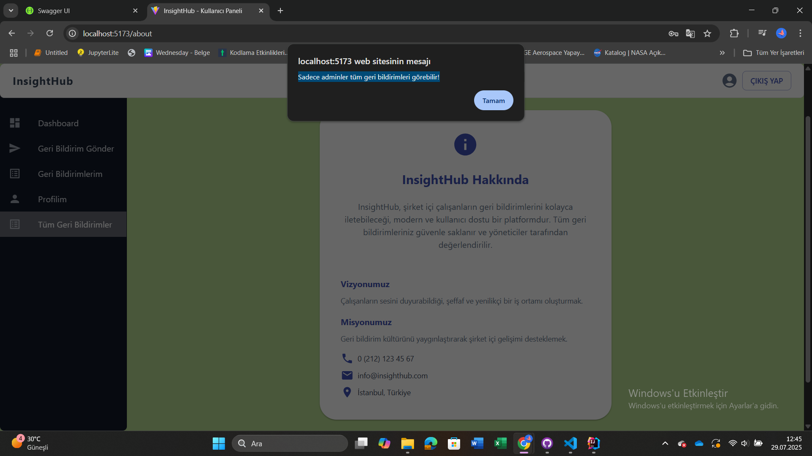

### 👤 Profil Sayfası
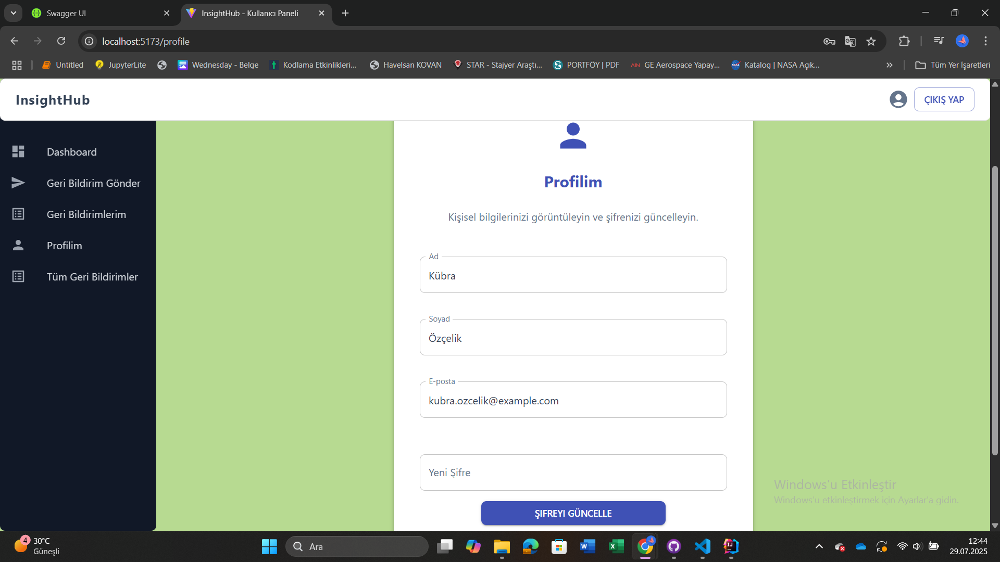

### 📊 Dashboard
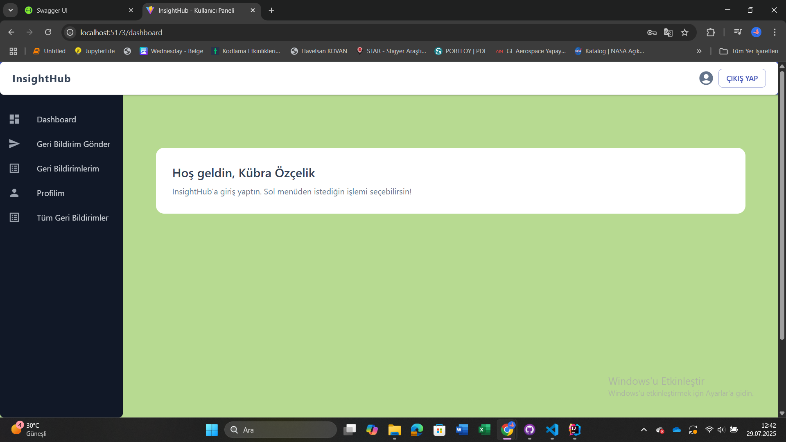

### 🧑‍💼 Admin Tüm Geri Bildirimleri Görüntüleme
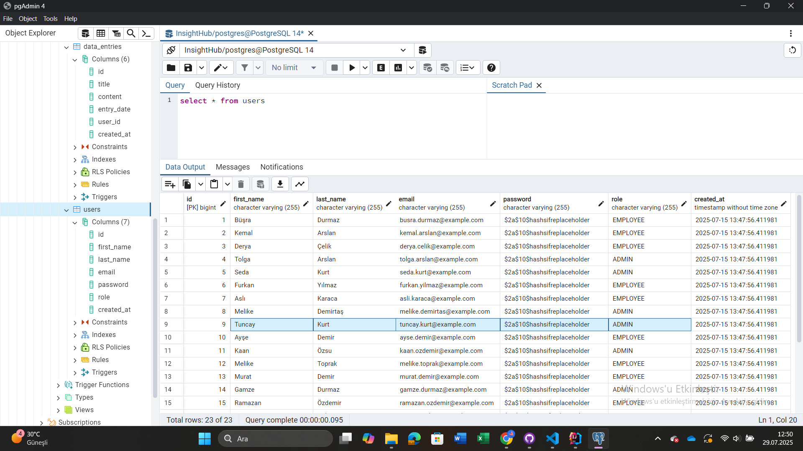

### 📅 Tarihe Göre Tüm Geri Bildirimleri Listeleme
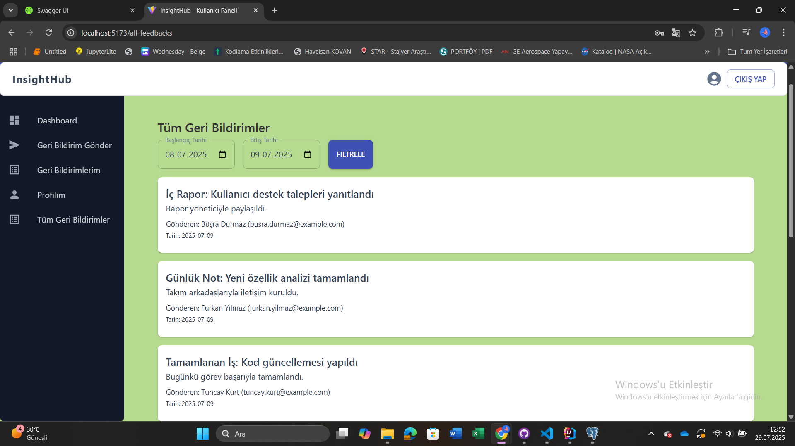

---

## 🔧 API ve Backend Yapısı

### Swagger UI
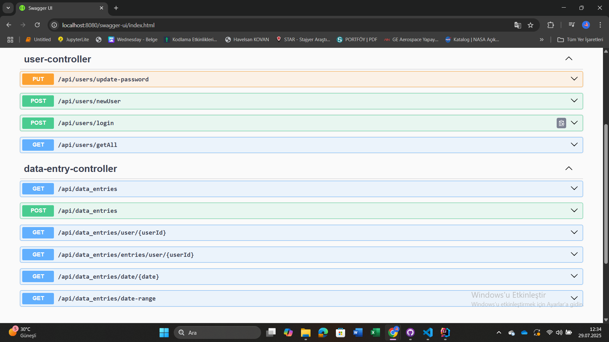

## 📌 API Endpoint Açıklamaları

InsightHub platformunda backend tarafı iki ana controller'a ayrılmıştır:

### 🧑‍💼 `UserController` – `/api/users`

#### 🔹 `GET /getAll`
Tüm kullanıcıları listelemek için kullanılır. Sadece admin panelinde anlamlıdır.

#### 🔹 `POST /newUser`
Yeni bir kullanıcıyı sisteme kayıt etmek için kullanılır. (Register işlemi)

#### 🔹 `POST /login`
Kullanıcının e-posta ve şifresine göre giriş yapmasını sağlar. Hatalı girişlerde uygun uyarı döner.

#### 🔹 `PUT /update-password`
Kullanıcının e-posta adresine göre şifresini güncellemesini sağlar. (Kurtarma senaryosu gibi)

---

### 📄 `DataEntryController` – `/api/data_entries`

#### 🔹 `GET /`
Sistemde yer alan tüm veri girişlerini döner. (Genellikle admin veya özel filtrelemeler için)

#### 🔹 `POST /`
Yeni bir veri girişini kaydetmek için kullanılır. Body'de `title`, `content`, `entry_date`, `user` gibi alanlar bekler.

#### 🔹 `GET /user/{userId}`
Belirli bir kullanıcıya ait girişleri getirir.

#### 🔹 `GET /entries/user/{userId}`
Eğer kullanıcı admin ise tüm verileri; değilse sadece kendi verilerini getirir. Rol kontrolü içerir.

#### 🔹 `GET /date/{date}`
Verilen tarih için yapılmış tüm girişleri döner.

#### 🔹 `GET /date-range?startDate=yyyy-mm-dd&endDate=yyyy-mm-dd`
İki tarih aralığındaki tüm girişleri getirir.

---
## 🧪 Test Edilmiş API Endpoint'leri (Görsel Destekli)

### Belirli Tarihe Göre Veri Getirme
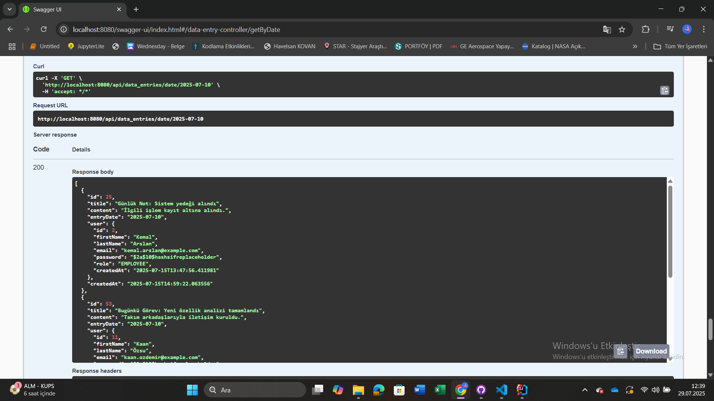

### Kullanıcıya Ait Verilerin Getirilmesi
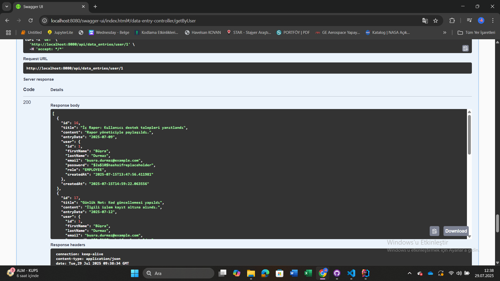

### Tüm Kullanıcıları Listeleme
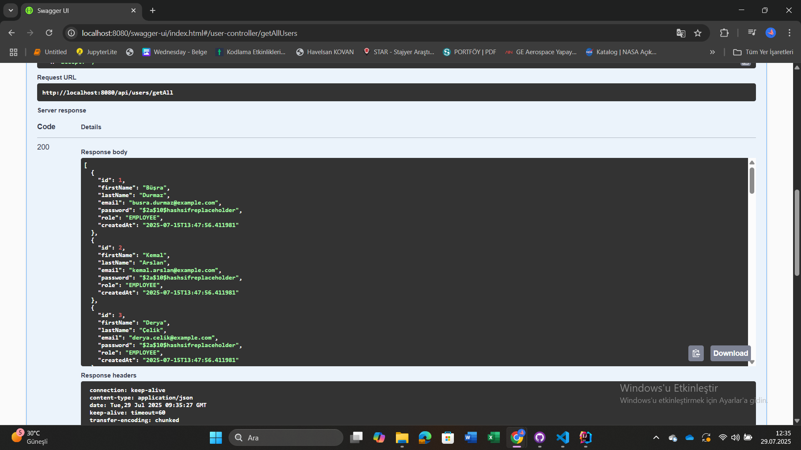

---

## 💻 Frontend Kurulumu

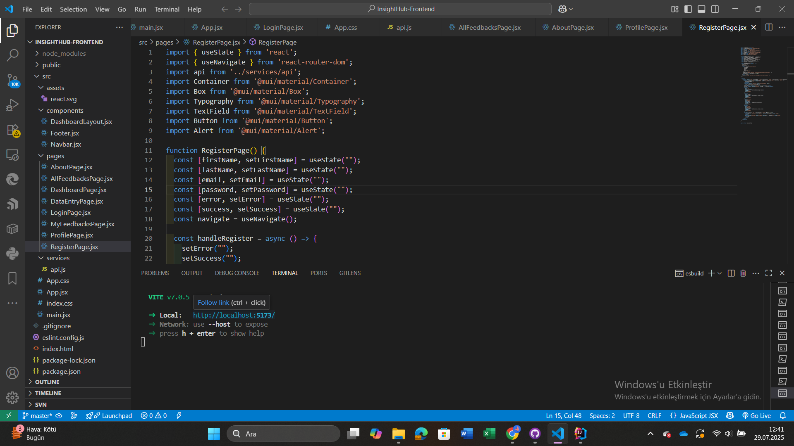

---

## ⚙️ Projeyi Çalıştırma

### Backend için:

```bash
cd backend
mvn clean install
java -jar target/InsightHub-0.0.1-SNAPSHOT.jar

### Frontend için
cd frontend
npm install
npm run dev

